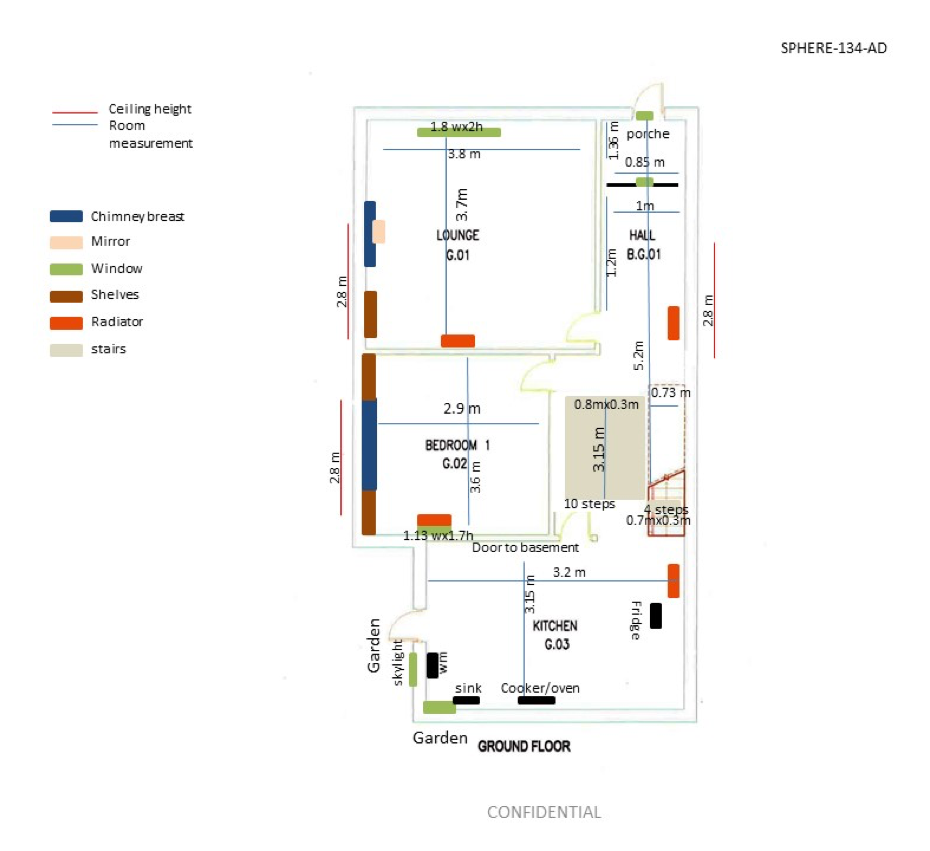
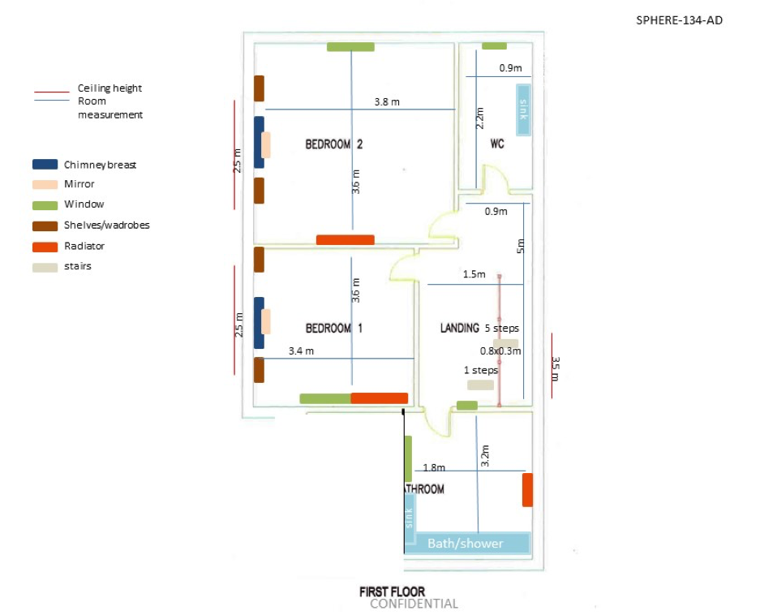

# Challenge Rules

## Sensors and the Smart Home

The following subsections describe the sensing modalities that are found in the smart home. All sensors are synchronised with network time protocol (NTP)

## Accelerometers

Participants wore a sensor equipped with a tri-axial accelerometer on the dominant wrist, attached using a strap. The sensor wirelessly transmits data using the Bluetooth Low Energy (BLE) standard to several access points (receivers) positioned within the house. The outputs of these sensors are a continuous numerical stream of the accelerometer readings (units of g, i.e. approximately 9.81ms-2). Accompanying the accelerometer readings are the received signal strength indications (RSSI) that were recorded by each access point (in units of dBm), and these data will be informative for indoor localisation. The accelerometers record data at 20 Hz, and the accelerometer ranges are between +/- 8 g. RSSI values are also recorded at 20 Hz, and values are no lower than -110 dBm.

Due to the nature of the sensing platform, there may be missing packets from the data.

## RGB-D Cameras

Video recordings were taken using ASUS Xtion PRO RGB-D cameras. Automatic detection of humans was performed using the OpenNI library`[2]`, and false positive detections were manually removed by the organizers by visual inspection.

In order to preserve the anonymity of the participants the raw video data are not shared. Instead, the coordinates of the 2D bounding box, 2D centre of mass, 3D bounding box and 3D centre of mass are provided.

The units of 2D coordinates are in pixels (i.e. number of pixels down and right from the upper left hand corner) from an image of size 640 &times; 480 pixels. The coordinate system of the 3D data is axis aligned with the 2D bounding box, with a supplementary dimension that projects from the central position of the video frames. The first two dimensions specify the vertical and horizontal displacement of a point from the central vector (in millimetres), and the final dimension specifies the projection of the object along the central vector (again, in millimetres).

RGB-D cameras are located in the living room, hallway, and the kitchen. No cameras are located elsewhere in the residence.

## Environmental sensors

The environmental sensing nodes are built on development platforms (Libelium, with CE marking`[3]`), powered by batteries or/and 5V DC converted from mains. Passive infra-red (PIR) sensors are employed to detect presence in the data. Values of 1 indicate that motion was detected, whereas values of 0 mean that no motion was detected.

## Floorplan of the smart home

`[1]` [https://www.asus.com/3D-Sensor/Xtion_PRO/](https://www.asus.com/3D-Sensor/Xtion_PRO/)

`[2]` [https://github.com/OpenNI/OpenNI](https://github.com/OpenNI/OpenNI)

`[3]` [http://www.libelium.com/](http://www.libelium.com/)

## Using this Data

The paper below provides a full description of the data and the data formats, and and any use of the data must cite this:

### Reference

Niall Twomey, Tom Diethe, Meelis Kull, Hao Song, Massimo Camplani, Sion Hannuna, Xenofon Fafoutis, Ni Zhu, Pete Woznowski, Peter Flach, and Ian Craddock. The SPHERE Challenge: Activity Recognition with Multimodal Sensor Data. 2016.

BibTeX

`@article{twomey2016sphere, title={The {SPHERE}&nbsp;Challenge: Activity Recognition with Multimodal Sensor Data},&nbsp;author={Twomey, Niall and Diethe, Tom and Kull, Meelis and Song, Hao and Camplani, Massimo and Hannuna, Sion and Fafoutis, Xenofon and Zhu, Ni and Woznowski, Pete and Flach, Peter and others}, journal={arXiv preprint arXiv:1603.00797}, year={2016}}`

## Contact Information

For any questions regarding the data, please contact: spherechallengeecml[at]gmail.com
